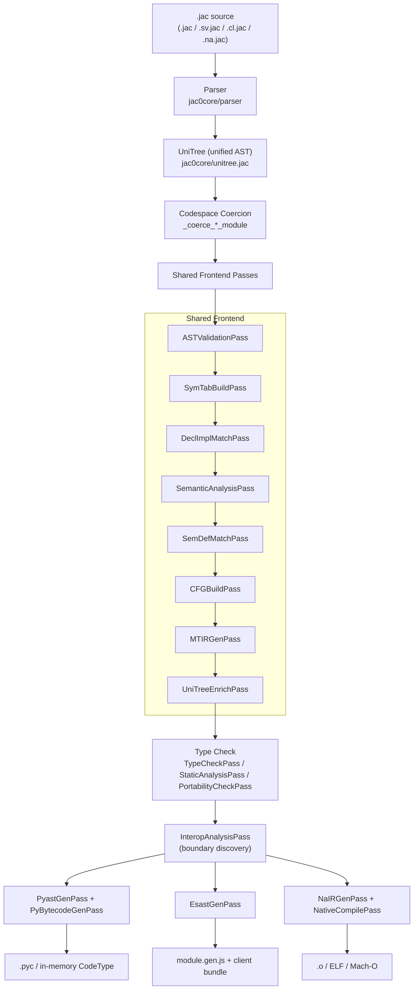
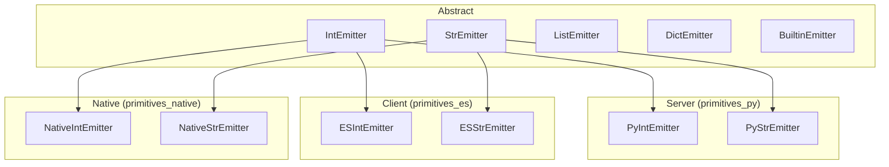

# Compiler Architecture: Three Codespaces

## Overview

Jac is a single source language that compiles to three different execution
targets, called **codespaces**:

| Codespace | Selector | Backend output | Runs on |
|-----------|----------|----------------|---------|
| **Server** (`sv`) | `to sv:` header, `sv` prefix, `.sv.jac` file, or default | Python AST → CPython bytecode | CPython |
| **Client** (`cl`) | `to cl:` header, `cl` prefix, or `.cl.jac` file | ESTree → JavaScript | Browsers / Node |
| **Native** (`na`) | `to na:` header, `na` prefix, or `.na.jac` file | LLVM IR → object code → executable | Bare machine (Linux / macOS, x86_64 / arm64) |

A single `.jac` file can mix all three codespaces. The compiler routes each
declaration to the correct backend, synthesises the interop bridges at the
boundary, and emits the appropriate artefact per codespace.

This document is the architectural map of how that pipeline is wired
together. It is intended for compiler contributors. For language-level
behaviour see [Primitives & Codespace Semantics](../reference/language/primitives.md);
for the user-facing native pathway see [Native Compilation](../reference/language/native-pathway.md).

---

## Pipeline at a Glance



The orchestration lives in [`jac0core/compiler.jac`](https://github.com/Jaseci-Labs/jaseci/blob/main/jac/jaclang/jac0core/compiler.jac).
Each named "schedule" function returns a list of `Transform[uni.Module, uni.Module]`
classes to run, and the `JacCompiler.compile` method walks them in order.

---

## Stage 1: Parsing and the Unified AST

Every codespace shares the **same front end**.

- Tokens are declared in [`jac0core/parser/tokens.na.jac`](https://github.com/Jaseci-Labs/jaseci/blob/main/jac/jaclang/jac0core/parser/tokens.na.jac).
  The `to`, `sv`, `cl`, and `na` keywords are ordinary tokens -- no codespace
  has a separate grammar.
- The grammar is in [`jac0core/parser/impl/parser.impl.jac`](https://github.com/Jaseci-Labs/jaseci/blob/main/jac/jaclang/jac0core/parser/impl/parser.impl.jac).
- AST nodes are defined in [`jac0core/unitree.jac`](https://github.com/Jaseci-Labs/jaseci/blob/main/jac/jaclang/jac0core/unitree.jac)
  (catalogued in [UniIR Nodes](uniir_node.md)).

Codespace-tagged regions surface as three sibling AST nodes:

| Source form | AST node |
|-------------|----------|
| `sv { ... }` block / `to sv:` region | `ServerBlock` |
| `cl { ... }` block / `to cl:` region | `ClientBlock` |
| `na { ... }` block / `to na:` region | `NativeBlock` |

The bootstrap compiler (`jac0.py`) and the full compiler share this front end
verbatim -- see [Abstractions Inventory](abstractions.md) for the full keyword
table.

---

## Stage 2: Codespace Coercion

After parsing, the compiler decides what context each top-level statement
belongs to. This is driven by the file extension and by the section
headers / blocks in the source.

The coercion helpers live in
[`compiler.jac:_coerce_module`](https://github.com/Jaseci-Labs/jaseci/blob/main/jac/jaclang/jac0core/compiler.jac#L250)
and three wrappers around it:

| Helper | Triggered by | What it does |
|--------|--------------|--------------|
| `_coerce_server_module` | `.sv.jac` extension | Unfolds `ServerBlock`, strips `ClientBlock`, marks remaining nodes `CodeContext.SERVER` |
| `_coerce_client_module` | `.cl.jac` extension | Unfolds `ClientBlock`, strips `ServerBlock`, marks `CodeContext.CLIENT` |
| `_coerce_native_module` | `.na.jac` extension | Unfolds `NativeBlock`, strips both `ServerBlock` and `ClientBlock`, marks `CodeContext.NATIVE` |

For mixed `.jac` files, the section header (`to sv:` / `to cl:` / `to na:`)
flips a parser-side default that the AST visitor uses to tag each
`ContextAwareNode` with its `code_context`. From this point on, every
declaration carries a `CodeContext` enum value that downstream passes use
to dispatch to the correct backend.

---

## Stage 3: Shared Frontend Analysis

These passes run regardless of codespace and are collected by
`get_ir_gen_sched` and `get_type_check_sched` in
[`compiler.jac`](https://github.com/Jaseci-Labs/jaseci/blob/main/jac/jaclang/jac0core/compiler.jac#L42).

| Pass | Source | Role |
|------|--------|------|
| `ASTValidationPass` | [`jac0core/passes/ast_validation_pass.jac`](https://github.com/Jaseci-Labs/jaseci/blob/main/jac/jaclang/jac0core/passes/ast_validation_pass.jac) | Structural validation of the parsed tree |
| `SymTabBuildPass` | [`jac0core/passes/sym_tab_build_pass.jac`](https://github.com/Jaseci-Labs/jaseci/blob/main/jac/jaclang/jac0core/passes/sym_tab_build_pass.jac) | Builds symbol tables; enforces sealed-field rules for archetypes |
| `DeclImplMatchPass` | [`jac0core/passes/decl_impl_match_pass.jac`](https://github.com/Jaseci-Labs/jaseci/blob/main/jac/jaclang/jac0core/passes/decl_impl_match_pass.jac) | Pairs declarations in `.jac` files with bodies in `.impl.jac` annexes |
| `SemanticAnalysisPass` | [`jac0core/passes/semantic_analysis_pass.jac`](https://github.com/Jaseci-Labs/jaseci/blob/main/jac/jaclang/jac0core/passes/semantic_analysis_pass.jac) | Name resolution, scope analysis |
| `SemDefMatchPass` | [`compiler/passes/main/sem_def_match_pass.jac`](https://github.com/Jaseci-Labs/jaseci/blob/main/jac/jaclang/compiler/passes/main/sem_def_match_pass.jac) | Matches `sem` blocks to definitions for `by llm` |
| `CFGBuildPass` | [`compiler/passes/main/cfg_build_pass.jac`](https://github.com/Jaseci-Labs/jaseci/blob/main/jac/jaclang/compiler/passes/main/cfg_build_pass.jac) | Builds control-flow graphs |
| `MTIRGenPass` | [`compiler/passes/main/mtir_gen_pass.jac`](https://github.com/Jaseci-Labs/jaseci/blob/main/jac/jaclang/compiler/passes/main/mtir_gen_pass.jac) | Generates Meaning-Typed IR for `by llm` calls |
| `UniTreeEnrichPass` | [`compiler/passes/main/unitree_enrich_pass.jac`](https://github.com/Jaseci-Labs/jaseci/blob/main/jac/jaclang/compiler/passes/main/unitree_enrich_pass.jac) | Annotates the tree with derived data needed by later passes |
| `TypeCheckPass` | [`compiler/passes/main/type_checker_pass.jac`](https://github.com/Jaseci-Labs/jaseci/blob/main/jac/jaclang/compiler/passes/main/type_checker_pass.jac) | Static type checking against the type registry |
| `PortabilityCheckPass` | [`compiler/passes/main/portability_check_pass.jac`](https://github.com/Jaseci-Labs/jaseci/blob/main/jac/jaclang/compiler/passes/main/portability_check_pass.jac) | Validates that types and ops used in `cl` / `na` regions exist in the target backend |

The pipeline uses a **re-entrancy guard** (`_ir_sched_loading`,
`_codegen_sched_loading`, `_typecheck_sched_loading`) so that compiling the
compiler's own pass modules degrades gracefully to the bootstrap subset
instead of recursing forever.

---

## Stage 4: Boundary Discovery -- `InteropAnalysisPass`

[`InteropAnalysisPass`](https://github.com/Jaseci-Labs/jaseci/blob/main/jac/jaclang/jac0core/passes/interop_analysis_pass.jac)
runs once *before* code generation. It walks every call site and records:

1. The `CodeContext` of the **caller** and **callee** (SERVER / CLIENT / NATIVE).
2. Type information on each parameter and return value at the boundary.
3. Imports that cross from a Python module into a `.na.jac` module (for
   native↔native linking).
4. Server-to-server calls that resolve to a different microservice
   (`sv import`).

The result is attached to the module as an `InteropManifest` of
`InteropBinding` entries (defined in
[`jac0core/codeinfo.jac`](https://github.com/Jaseci-Labs/jaseci/blob/main/jac/jaclang/jac0core/codeinfo.jac)).
Each backend reads this manifest and generates the appropriate bridge
stub: an HTTP fetch for `cl → sv`, a ctypes call for `sv → na`, or a
direct native symbol reference for `na → na`.

---

## Stage 5: Backend Code Generation

`get_py_code_gen` returns the codegen schedule. All three backends share a
common base class -- [`ModuleCodegenPass`](https://github.com/Jaseci-Labs/jaseci/blob/main/jac/jaclang/jac0core/passes/module_codegen_pass.jac)
(or `BaseAstGenPass` for AST-emitting passes) -- and **each pass only emits
nodes whose `code_context` matches its target**. A node tagged `CLIENT` is
invisible to the Python codegen and vice versa.

### Server backend -- `to sv:`

| Pass | Source | Output |
|------|--------|--------|
| `PyastGenPass` | [`jac0core/passes/pyast_gen_pass.jac`](https://github.com/Jaseci-Labs/jaseci/blob/main/jac/jaclang/jac0core/passes/pyast_gen_pass.jac) (+ [impl](https://github.com/Jaseci-Labs/jaseci/blob/main/jac/jaclang/jac0core/passes/impl/pyast_gen_pass.impl.jac)) | Python `ast.Module` |
| `PyJacAstLinkPass` | [`compiler/passes/main/pyjac_ast_link_pass.jac`](https://github.com/Jaseci-Labs/jaseci/blob/main/jac/jaclang/compiler/passes/main/pyjac_ast_link_pass.jac) | Back-links Python AST nodes to the originating Jac nodes (used for diagnostics and the type registry) |
| `PyBytecodeGenPass` | [`jac0core/passes/pybc_gen_pass.jac`](https://github.com/Jaseci-Labs/jaseci/blob/main/jac/jaclang/jac0core/passes/pybc_gen_pass.jac) | `types.CodeType` via `compile()` |

Archetype `has` fields become dataclass fields wrapped with
`_.field(default=…)` or `_.field(factory=lambda: …)`. Walkers, nodes, and
edges descend from the corresponding `Archetype` subclasses in
[`jac0core/archetype.jac`](https://github.com/Jaseci-Labs/jaseci/blob/main/jac/jaclang/jac0core/archetype.jac).
Builtins and language keywords ultimately resolve to methods on
`JacRuntimeInterface` in [`jac0core/runtime.jac`](https://github.com/Jaseci-Labs/jaseci/blob/main/jac/jaclang/jac0core/runtime.jac).

The primitive type contract for this backend lives in
[`pycore/passes/primitives_py.jac`](https://github.com/Jaseci-Labs/jaseci/blob/main/jac/jaclang/pycore/passes/primitives_py.jac).

### Client backend -- `to cl:`

| Pass | Source | Output |
|------|--------|--------|
| `EsastGenPass` | [`compiler/passes/ecmascript/esast_gen_pass.jac`](https://github.com/Jaseci-Labs/jaseci/blob/main/jac/jaclang/compiler/passes/ecmascript/esast_gen_pass.jac) (+ [impl](https://github.com/Jaseci-Labs/jaseci/blob/main/jac/jaclang/compiler/passes/ecmascript/impl/esast_gen_pass.impl.jac)) | ESTree AST + serialised JS (`module.gen.js`) |

`EsastGenPass` derives from `BaseAstGenPass` (shared with `PyastGenPass`)
so the same traversal infrastructure visits the tree but emits ESTree
nodes from [`compiler/passes/ecmascript/estree.jac`](https://github.com/Jaseci-Labs/jaseci/blob/main/jac/jaclang/compiler/passes/ecmascript/estree.jac).
Key components of the client backend:

- **Primitive emitters** -- [`primitives_es.jac`](https://github.com/Jaseci-Labs/jaseci/blob/main/jac/jaclang/compiler/passes/ecmascript/primitives_es.jac)
  provides `ESIntEmitter`, `ESStrEmitter`, etc. that satisfy the abstract
  emitter contract (see *Primitive Emitter Contract* below).
- **Unparser** -- [`es_unparse.jac`](https://github.com/Jaseci-Labs/jaseci/blob/main/jac/jaclang/compiler/passes/ecmascript/es_unparse.jac)
  walks the ESTree and prints JavaScript source.
- **Runtime** -- [`jac_runtime_js.jac`](https://github.com/Jaseci-Labs/jaseci/blob/main/jac/jaclang/compiler/passes/ecmascript/jac_runtime_js.jac)
  is the small JS runtime that ships with every client bundle (signals,
  reactive state, JSX renderer, hash router, fetch helpers).
- **JSX lowering** -- `EsJsxProcessor` in
  [`jac0core/passes/ast_gen/jsx_processor.jac`](https://github.com/Jaseci-Labs/jaseci/blob/main/jac/jaclang/jac0core/passes/ast_gen/jsx_processor.jac)
  is shared between the server and client AST generators so JSX tags compile
  consistently regardless of where they appear.

The `jac-client` plugin packages the generated `module.gen.js`, the JS
runtime, and an HTML shell into a static bundle. Cross-codespace calls
(`cl → sv`) are lowered into HTTP requests against the walker / function
endpoints exposed by `jac start`. The client is currently **CSR-only**:
the server returns an HTML shell with a bootstrapping payload, and the
browser handles all rendering.

### Native backend -- `to na:`

| Pass | Source | Output |
|------|--------|--------|
| `NaIRGenPass` | [`compiler/passes/native/na_ir_gen_pass.jac`](https://github.com/Jaseci-Labs/jaseci/blob/main/jac/jaclang/compiler/passes/native/na_ir_gen_pass.jac) | LLVM IR (`llvmlite.ir.Module`) |
| `NativeCompilePass` | [`compiler/passes/native/na_compile_pass.jac`](https://github.com/Jaseci-Labs/jaseci/blob/main/jac/jaclang/compiler/passes/native/na_compile_pass.jac) | Object code (ELF or Mach-O) |

`NaIRGenPass` is unusual in that it does **not** use the visitor pattern;
LLVM requires instructions to be emitted into specific basic blocks in
order, so it walks the AST manually. The pass derives directly from
`ModuleCodegenPass`. Primitive types are defined in
[`primitives_native.jac`](https://github.com/Jaseci-Labs/jaseci/blob/main/jac/jaclang/compiler/passes/native/primitives_native.jac).

Linking is also self-contained -- no external linker is invoked:

- [`linker_common.jac`](https://github.com/Jaseci-Labs/jaseci/blob/main/jac/jaclang/compiler/passes/native/linker_common.jac)
  -- shared layout logic
- [`elf_linker.jac`](https://github.com/Jaseci-Labs/jaseci/blob/main/jac/jaclang/compiler/passes/native/elf_linker.jac)
  -- Linux ELF64 object writer
- [`macho_linker.jac`](https://github.com/Jaseci-Labs/jaseci/blob/main/jac/jaclang/compiler/passes/native/macho_linker.jac)
  -- macOS Mach-O object writer

The native backend supplies its own memory management: a 32-byte
allocation header with reference counts (see `HDR_*` globals in
`na_ir_gen_pass.jac`). Cross-codespace calls between Python and native
flow through the interop bridge generated from `InteropAnalysisPass`.

---

## Primitive Emitter Contract

Every backend implements the same abstract emitter interface. This is what
makes "`'hello'.upper()` works in all three codespaces" a guarantee rather
than a convention.



Twelve emitter families are defined, one per primitive type (`int`,
`float`, `str`, `bytes`, `list`, `dict`, `set`, `frozenset`, `tuple`,
`range`, `complex`) plus `BuiltinEmitter` for top-level functions like
`print()`, `len()`, `range()`, `sorted()`. The codegen pass calls
`StrEmitter.emit_op_add(...)` and the appropriate subclass produces
Python `BinOp`, an ES `BinaryExpression`, or an LLVM `call @str_concat`.

If a backend hasn't implemented an operation, the emitter returns `None`
and the compiler raises a diagnostic at compile time -- see the diagnostic
codes in [`jac0core/diagnostics.jac`](https://github.com/Jaseci-Labs/jaseci/blob/main/jac/jaclang/jac0core/diagnostics.jac).

The full list of primitives and operators per type lives in the
user-facing reference, [Primitives & Codespace Semantics](../reference/language/primitives.md).

---

## Cross-Codespace Interop

`InteropAnalysisPass` discovers boundaries; the backends close them.

| Direction | Bridge | Generated by |
|-----------|--------|--------------|
| `cl → sv` | HTTP `POST` to the walker / function endpoint exposed by `jac start` | `EsastGenPass` emits `fetch(...)` against the URL recorded in the binding |
| `sv → cl` | None at runtime -- the client mounts its own DOM. The server only ships the bootstrap payload | `PyastGenPass` emits the static-file route for the bundle |
| `sv → na` | ctypes call into the native shared object | `PyastGenPass` emits a `ctypes.CFUNCTYPE` stub; `NaIRGenPass` exposes the function with C ABI |
| `na → sv` | C-callable thunk that re-enters CPython via the limited API | Generated alongside the `sv → na` stub |
| `na → na` | Direct symbol reference resolved by the in-tree linker | `InteropAnalysisPass` records the import; `NativeCompilePass` emits the relocation |
| `sv → sv` (microservice) | HTTP between processes when an `sv import` resolves to a different deployment | `PyastGenPass` emits an `httpx` call; the manifest is consumed by `jac-scale` |

Boundary types are serialised through the schemas in
[`codeinfo.jac`](https://github.com/Jaseci-Labs/jaseci/blob/main/jac/jaclang/jac0core/codeinfo.jac).
The primitive contract guarantees that types like `int` and `list[str]`
mean the same thing on both sides; non-primitive types must be reachable
in both codespaces (typically as plain `obj` archetypes).

---

## Caching

The compiler keeps two on-disk caches so the front end and back end can be
skipped when nothing has changed.

| Cache | Location | Invalidated when |
|-------|----------|------------------|
| **Bootstrap** | `~/.cache/jac/jir/bootstrap/` | A `jac0core/` file or `jac0.py` changes |
| **Module** | `~/.cache/jac/jir/modules/` | The full compiler's output format changes, or the source / its imports change |

Each cache entry is a **JIR file** (Jac IR) with named sections defined in
[`jac0core/jir.jac`](https://github.com/Jaseci-Labs/jaseci/blob/main/jac/jaclang/jac0core/jir.jac):

| Section | Contents |
|---------|----------|
| `SEC_BYTECODE` | Marshalled Python `CodeType` (server backend) |
| `SEC_MTIR` | Meaning-Typed IR for `by llm` calls |
| `SEC_LLVM_IR` | LLVM IR text (native backend) |
| `SEC_NATIVE_OBJ` | Compiled ELF/Mach-O object (native backend) |
| `SEC_INTEROP` | Serialised `InteropManifest` |

A precompiled section is replayed via `JacCompiler._load_native_from_cache`
/ `_load_native_from_bitcode` instead of re-running the codegen pass.

When debugging compiler changes, clear the relevant cache:

```bash
# Bootstrap or core compiler change
rm -rf ~/.cache/jac/jir/

# Or just user modules
rm -rf ~/.cache/jac/jir/modules/
```

---

## Key Files

A short index, organised by the role each file plays in the pipeline.

**Orchestration**

- [`jac0core/compiler.jac`](https://github.com/Jaseci-Labs/jaseci/blob/main/jac/jaclang/jac0core/compiler.jac)
  -- `JacCompiler`, schedule functions, codespace coercion
- [`jac0core/program.jac`](https://github.com/Jaseci-Labs/jaseci/blob/main/jac/jaclang/jac0core/program.jac)
  -- `JacProgram`, the module hub passes operate on
- [`jac0core/passes/transform.jac`](https://github.com/Jaseci-Labs/jaseci/blob/main/jac/jaclang/jac0core/passes/transform.jac)
  -- `Transform[I, O]` base class for every pass
- [`jac0core/passes/uni_pass.jac`](https://github.com/Jaseci-Labs/jaseci/blob/main/jac/jaclang/jac0core/passes/uni_pass.jac)
  -- `UniPass`, the AST-visitor base class

**Shared front end**

- [`jac0core/parser/`](https://github.com/Jaseci-Labs/jaseci/tree/main/jac/jaclang/jac0core/parser)
  -- tokens and grammar
- [`jac0core/unitree.jac`](https://github.com/Jaseci-Labs/jaseci/blob/main/jac/jaclang/jac0core/unitree.jac)
  -- UniTree AST nodes ([reference](uniir_node.md))
- [`jac0core/constant.jac`](https://github.com/Jaseci-Labs/jaseci/blob/main/jac/jaclang/jac0core/constant.jac)
  -- `CodeContext`, `Tokens`, shared enums
- [`jac0core/codeinfo.jac`](https://github.com/Jaseci-Labs/jaseci/blob/main/jac/jaclang/jac0core/codeinfo.jac)
  -- `InteropManifest`, `InteropBinding`, `BoundaryTypeInfo`

**Server backend (`sv`)**

- [`jac0core/passes/pyast_gen_pass.jac`](https://github.com/Jaseci-Labs/jaseci/blob/main/jac/jaclang/jac0core/passes/pyast_gen_pass.jac)
  / [impl](https://github.com/Jaseci-Labs/jaseci/blob/main/jac/jaclang/jac0core/passes/impl/pyast_gen_pass.impl.jac)
- [`jac0core/passes/pybc_gen_pass.jac`](https://github.com/Jaseci-Labs/jaseci/blob/main/jac/jaclang/jac0core/passes/pybc_gen_pass.jac)
- [`pycore/passes/primitives_py.jac`](https://github.com/Jaseci-Labs/jaseci/blob/main/jac/jaclang/pycore/passes/primitives_py.jac)
- [`jac0core/runtime.jac`](https://github.com/Jaseci-Labs/jaseci/blob/main/jac/jaclang/jac0core/runtime.jac)
  -- `JacRuntimeInterface`

**Client backend (`cl`)**

- [`compiler/passes/ecmascript/esast_gen_pass.jac`](https://github.com/Jaseci-Labs/jaseci/blob/main/jac/jaclang/compiler/passes/ecmascript/esast_gen_pass.jac)
- [`compiler/passes/ecmascript/estree.jac`](https://github.com/Jaseci-Labs/jaseci/blob/main/jac/jaclang/compiler/passes/ecmascript/estree.jac)
- [`compiler/passes/ecmascript/es_unparse.jac`](https://github.com/Jaseci-Labs/jaseci/blob/main/jac/jaclang/compiler/passes/ecmascript/es_unparse.jac)
- [`compiler/passes/ecmascript/primitives_es.jac`](https://github.com/Jaseci-Labs/jaseci/blob/main/jac/jaclang/compiler/passes/ecmascript/primitives_es.jac)
- [`compiler/passes/ecmascript/jac_runtime_js.jac`](https://github.com/Jaseci-Labs/jaseci/blob/main/jac/jaclang/compiler/passes/ecmascript/jac_runtime_js.jac)
  -- in-browser runtime
- [`jac0core/passes/ast_gen/jsx_processor.jac`](https://github.com/Jaseci-Labs/jaseci/blob/main/jac/jaclang/jac0core/passes/ast_gen/jsx_processor.jac)
  -- JSX lowering

**Native backend (`na`)**

- [`compiler/passes/native/na_ir_gen_pass.jac`](https://github.com/Jaseci-Labs/jaseci/blob/main/jac/jaclang/compiler/passes/native/na_ir_gen_pass.jac)
- [`compiler/passes/native/na_compile_pass.jac`](https://github.com/Jaseci-Labs/jaseci/blob/main/jac/jaclang/compiler/passes/native/na_compile_pass.jac)
- [`compiler/passes/native/elf_linker.jac`](https://github.com/Jaseci-Labs/jaseci/blob/main/jac/jaclang/compiler/passes/native/elf_linker.jac)
  / [`macho_linker.jac`](https://github.com/Jaseci-Labs/jaseci/blob/main/jac/jaclang/compiler/passes/native/macho_linker.jac)
- [`compiler/passes/native/primitives_native.jac`](https://github.com/Jaseci-Labs/jaseci/blob/main/jac/jaclang/compiler/passes/native/primitives_native.jac)

**Interop**

- [`jac0core/passes/interop_analysis_pass.jac`](https://github.com/Jaseci-Labs/jaseci/blob/main/jac/jaclang/jac0core/passes/interop_analysis_pass.jac)
- [`jac0core/interop_bridge.jac`](https://github.com/Jaseci-Labs/jaseci/blob/main/jac/jaclang/jac0core/interop_bridge.jac)

**Caching**

- [`jac0core/jir.jac`](https://github.com/Jaseci-Labs/jaseci/blob/main/jac/jaclang/jac0core/jir.jac)
  -- section format
- [`jac0core/bccache.jac`](https://github.com/Jaseci-Labs/jaseci/blob/main/jac/jaclang/jac0core/bccache.jac)
  -- cache layout

---

## Related Documents

- [Abstractions Inventory](abstractions.md) -- every user-visible keyword,
  builtin, and standard-library entry, mapped to its parser, AST node, and
  runtime.
- [UniIR Nodes](uniir_node.md) -- full AST node reference.
- [Import Patterns](jac_import_patterns.md) -- how variant modules
  (`.sv.jac`, `.cl.jac`, `.na.jac`) merge into one logical module.
- [Primitives & Codespace Semantics](../reference/language/primitives.md)
  -- user-facing contract that the emitters satisfy.
- [Native Compilation](../reference/language/native-pathway.md) -- user
  documentation for the `na` codespace.
