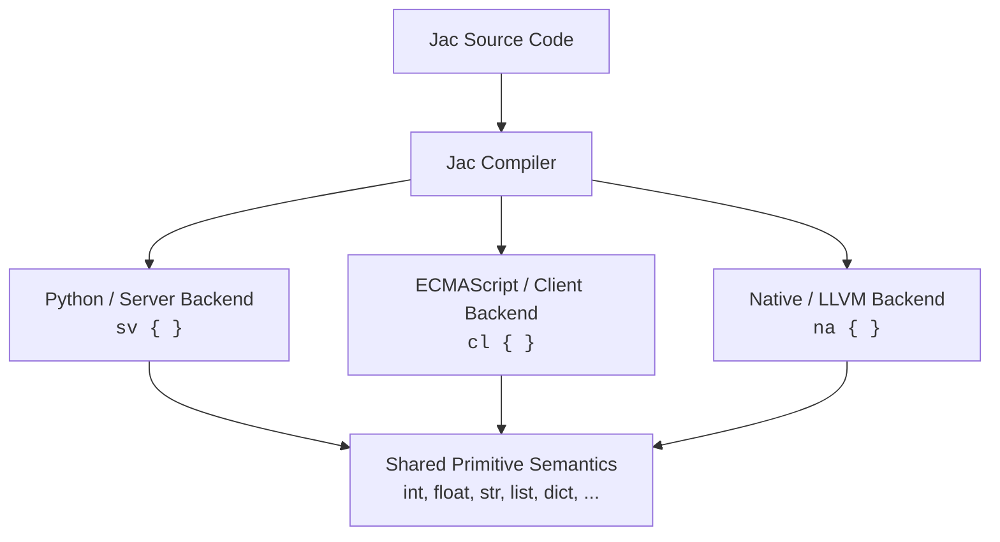

# Primitives and Codespace Semantics

**In this part:**

- [Overview](#overview) - What are primitives and why they matter across codespaces
- [Codespace Model](#codespace-model) - Server, Client, and Native compilation targets
- [Primitive Types](#primitive-types) - The fixed set of types shared across all codespaces
- [Operator Semantics](#operator-semantics) - Uniform operator behavior across backends
- [Builtin Functions](#builtin-functions) - Functions available in every codespace
- [Backend Contract](#backend-contract) - How each codespace implements the primitives

---

## Overview

Jac programs can target multiple execution environments -- a Python-based server, a JavaScript-based browser client, or a native LLVM-compiled binary -- yet all three share the **same source language** and the **same set of primitive types, operators, and builtin functions**. This page documents that fixed set of semantics: the contract that every Jac codespace must honor.

The key insight is that Jac's compiler does not simply transpile syntax; it implements a **primitive codegen interface** -- a collection of abstract emitter classes that each backend (Python/server, ECMAScript/client, Native/LLVM) must subclass. This ensures that an `int` behaves like an `int`, a `list` behaves like a `list`, and `print()` works -- regardless of where the code executes.



---

## Codespace Model

A **codespace** determines *where* your code runs. You select a codespace with either a file extension or an inline block prefix:

| Codespace | Block Prefix | File Extension | Compiles To | Ecosystem |
|-----------|-------------|----------------|-------------|-----------|
| Server    | `sv { }` | `.sv.jac` or `.jac` (default) | Python | PyPI |
| Client    | `cl { }` | `.cl.jac` | JavaScript / TypeScript | npm |
| Native    | `na { }` | `.na.jac` | LLVM IR → machine code | C ABI |

Code outside any block defaults to the server codespace. Any `.jac` file can mix codespace blocks:

```jac
# Server (default codespace)
def add(a: int, b: int) -> int {
    return a + b;
}

cl {
    # Client -- compiles to JavaScript
    def greet(name: str) -> str {
        return "Hello, " + name;
    }
}

na {
    # Native -- compiles to machine code
    def fast_sum(n: int) -> int {
        has total: int = 0;
        for i in range(n) {
            total += i;
        }
        return total;
    }
}
```

### Cross-Codespace Interop

When code in one codespace calls a function in another, the compiler generates the interop layer automatically -- HTTP calls between server and client, FFI bridges between Python and native, serialization and deserialization at boundaries.

```jac
# Server function
def:pub fetch_items() -> list[dict] {
    return [{"id": 1, "name": "Item A"}];
}

cl {
    # Client calls server -- compiler generates the HTTP call
    async def load() -> None {
        items = await fetch_items();
    }
}
```

### What Is Shared

Regardless of codespace, the following are identical:

- **Primitive types** -- `int`, `float`, `str`, `bool`, `bytes`, `list`, `dict`, `set`, `tuple`, `frozenset`, `range`, `complex`
- **Operator semantics** -- `+` on two ints always means addition; `+` on two strings always means concatenation
- **Builtin functions** -- `print()`, `len()`, `range()`, `sorted()`, etc.
- **Type conversion** -- `int()`, `str()`, `float()`, `bool()`, etc.
- **Control flow** -- `if`, `for`, `while`, `match`, comprehensions

What *differs* between codespaces is the **underlying implementation**: Python objects, JavaScript values, or LLVM IR instructions. The compiler guarantees behavioral equivalence through the primitive emitter contract described below.

---

## Primitive Types

Jac defines 12 primitive type families. Each type has a fixed set of named methods and operator behaviors that all backends must implement.

### Numeric Types

#### `int` -- Integer

Arbitrary-precision integer (server), 64-bit integer (native), `number` / `BigInt` (client).

**Named methods:**

| Method | Description |
|--------|-------------|
| `bit_length()` | Number of bits needed to represent the value |
| `bit_count()` | Number of set bits (popcount) |
| `to_bytes(length, byteorder)` | Convert to bytes representation |
| `as_integer_ratio()` | Return `(numerator, denominator)` pair |
| `conjugate()` | Returns the value itself (complex compatibility) |
| `from_bytes(bytes, byteorder)` | *Static* -- construct int from bytes |

**Operators:**

| Category | Operators |
|----------|-----------|
| Arithmetic | `+` `-` `*` `/` `//` `%` `**` |
| Bitwise | `&` `\|` `^` `<<` `>>` |
| Comparison | `==` `!=` `<` `>` `<=` `>=` |
| Unary | `-x` `+x` `~x` |

#### `float` -- Floating Point

IEEE 754 double-precision (64-bit) across all codespaces.

**Named methods:**

| Method | Description |
|--------|-------------|
| `is_integer()` | True if the float is an exact integer value |
| `as_integer_ratio()` | Exact `(numerator, denominator)` pair |
| `conjugate()` | Returns the value itself |
| `hex()` | Hexadecimal string representation |
| `fromhex(s)` | *Static* -- construct float from hex string |

**Operators:**

| Category | Operators |
|----------|-----------|
| Arithmetic | `+` `-` `*` `/` `//` `%` `**` |
| Comparison | `==` `!=` `<` `>` `<=` `>=` |
| Unary | `-x` `+x` |

#### `complex` -- Complex Number

Complex number with real and imaginary parts.

**Named methods:**

| Method | Description |
|--------|-------------|
| `conjugate()` | Returns the complex conjugate |

**Operators:**

| Category | Operators |
|----------|-----------|
| Arithmetic | `+` `-` `*` `/` `**` |
| Comparison | `==` `!=` |
| Unary | `-x` `+x` |

!!! note "No ordering on complex"
    Complex numbers support equality checks but not ordering (`<`, `>`, `<=`, `>=`) -- this is enforced across all codespaces.

---

### String and Byte Types

#### `str` -- String

Unicode text string. Immutable.

**Named methods:**

| Category | Methods |
|----------|---------|
| Case conversion | `capitalize()`, `casefold()`, `lower()`, `upper()`, `title()`, `swapcase()` |
| Searching | `count()`, `find()`, `rfind()`, `index()`, `rindex()`, `startswith()`, `endswith()` |
| Modification | `replace()`, `strip()`, `lstrip()`, `rstrip()`, `removeprefix()`, `removesuffix()` |
| Splitting | `split()`, `rsplit()`, `splitlines()`, `join()`, `partition()`, `rpartition()` |
| Formatting | `format()`, `format_map()`, `center()`, `ljust()`, `rjust()`, `zfill()`, `expandtabs()` |
| Character tests | `isalnum()`, `isalpha()`, `isascii()`, `isdecimal()`, `isdigit()`, `isidentifier()`, `islower()`, `isnumeric()`, `isprintable()`, `isspace()`, `istitle()`, `isupper()` |
| Encoding | `encode()` |
| Translation | `translate()`, `maketrans()` |

**Operators:**

| Operator | Meaning |
|----------|---------|
| `+` | Concatenation |
| `*` | Repetition |
| `%` | printf-style formatting |
| `==` `!=` | Equality |
| `<` `>` `<=` `>=` | Lexicographic comparison |
| `in` | Substring test |

#### `bytes` -- Byte Sequence

Immutable sequence of bytes (0-255). Mirrors most `str` methods but operates on byte values.

**Named methods:**

| Category | Methods |
|----------|---------|
| Encoding | `decode()`, `hex()`, `fromhex()` |
| Searching | `count()`, `find()`, `rfind()`, `index()`, `rindex()`, `startswith()`, `endswith()` |
| Modification | `replace()`, `strip()`, `lstrip()`, `rstrip()`, `removeprefix()`, `removesuffix()` |
| Splitting | `split()`, `rsplit()`, `splitlines()`, `join()`, `partition()`, `rpartition()` |
| Case (ASCII) | `capitalize()`, `lower()`, `upper()`, `title()`, `swapcase()` |
| Char tests (ASCII) | `isalnum()`, `isalpha()`, `isascii()`, `isdigit()`, `islower()`, `isspace()`, `istitle()`, `isupper()` |
| Alignment | `center()`, `ljust()`, `rjust()`, `zfill()`, `expandtabs()` |
| Translation | `translate()`, `maketrans()` |

**Operators:**

| Operator | Meaning |
|----------|---------|
| `+` | Concatenation |
| `*` | Repetition |
| `%` | printf-style formatting |
| `==` `!=` | Equality |
| `<` `>` `<=` `>=` | Lexicographic comparison |
| `in` | Byte membership |

---

### Collection Types

#### `list` -- Mutable Sequence

Ordered, mutable collection. Supports indexing, slicing, and iteration.

**Named methods:**

| Method | Description |
|--------|-------------|
| `append(x)` | Add item to end |
| `extend(iterable)` | Append all items from iterable |
| `insert(i, x)` | Insert item at position |
| `remove(x)` | Remove first occurrence |
| `pop([i])` | Remove and return item at index |
| `clear()` | Remove all items |
| `index(x)` | Index of first occurrence |
| `count(x)` | Count occurrences |
| `sort()` | Sort in-place |
| `reverse()` | Reverse in-place |
| `copy()` | Shallow copy |

**Operators:**

| Operator | Meaning |
|----------|---------|
| `+` | Concatenation |
| `*` | Repetition |
| `==` `!=` | Structural equality |
| `<` `>` `<=` `>=` | Lexicographic comparison |
| `in` | Membership test |
| `+=` | Extend in-place |
| `*=` | Repeat in-place |

#### `dict` -- Key-Value Mapping

Ordered mapping from keys to values (insertion order preserved).

**Named methods:**

| Method | Description |
|--------|-------------|
| `get(key[, default])` | Get value or default |
| `keys()` | View of keys |
| `values()` | View of values |
| `items()` | View of key-value pairs |
| `pop(key[, default])` | Remove and return value |
| `popitem()` | Remove and return last pair |
| `setdefault(key[, default])` | Get or set default |
| `update(mapping)` | Update from another mapping |
| `clear()` | Remove all items |
| `copy()` | Shallow copy |
| `fromkeys(iterable[, value])` | *Static* -- create dict from keys |

**Operators:**

| Operator | Meaning |
|----------|---------|
| `\|` | Merge (returns new dict) |
| `==` `!=` | Structural equality |
| `in` | Key membership |
| `\|=` | Update in-place |

#### `set` -- Mutable Unordered Collection

Unordered collection of unique hashable elements.

**Named methods:**

| Category | Methods |
|----------|---------|
| Mutation | `add()`, `remove()`, `discard()`, `pop()`, `clear()` |
| Set algebra | `union()`, `intersection()`, `difference()`, `symmetric_difference()` |
| In-place algebra | `update()`, `intersection_update()`, `difference_update()`, `symmetric_difference_update()` |
| Tests | `issubset()`, `issuperset()`, `isdisjoint()`, `copy()` |

**Operators:**

| Operator | Meaning |
|----------|---------|
| `\|` | Union |
| `&` | Intersection |
| `-` | Difference |
| `^` | Symmetric difference |
| `==` `!=` | Set equality |
| `<=` `<` | Subset / proper subset |
| `>=` `>` | Superset / proper superset |
| `in` | Membership |
| `\|=` `&=` `-=` `^=` | In-place variants |

#### `frozenset` -- Immutable Set

Same semantics as `set` but immutable -- no mutation methods and no in-place operators. Supports all the same algebra operators and comparison operators.

#### `tuple` -- Immutable Sequence

Ordered, immutable collection. Supports indexing and iteration.

**Named methods:**

| Method | Description |
|--------|-------------|
| `count(x)` | Count occurrences |
| `index(x)` | Index of first occurrence |

**Operators:**

| Operator | Meaning |
|----------|---------|
| `+` | Concatenation |
| `*` | Repetition |
| `==` `!=` | Structural equality |
| `<` `>` `<=` `>=` | Lexicographic comparison |
| `in` | Membership test |

#### `range` -- Immutable Integer Sequence

Lazy integer sequence, typically used in `for` loops.

**Named methods:**

| Method | Description |
|--------|-------------|
| `count(x)` | Count occurrences |
| `index(x)` | Index of value |

**Operators:**

| Operator | Meaning |
|----------|---------|
| `==` `!=` | Equality |
| `in` | Membership test |

---

### Fixed-Width Types (Native Codespace)

The native codespace adds fixed-width types for C interop. These types map directly to hardware registers and C ABI types:

| Jac Type | Width | Signed | C Equivalent |
|----------|-------|--------|--------------|
| `i8` | 8-bit | Yes | `int8_t` |
| `u8` | 8-bit | No | `uint8_t` |
| `i16` | 16-bit | Yes | `int16_t` |
| `u16` | 16-bit | No | `uint16_t` |
| `i32` | 32-bit | Yes | `int32_t` |
| `u32` | 32-bit | No | `uint32_t` |
| `i64` | 64-bit | Yes | `int64_t` |
| `u64` | 64-bit | No | `uint64_t` |
| `f32` | 32-bit | -- | `float` |
| `f64` | 64-bit | -- | `double` |
| `c_void` | -- | -- | `void*` |

The compiler automatically coerces between Jac's standard types (`int` = `i64`, `float` = `f64`) and fixed-width types at call boundaries.

---

## Operator Semantics

Operators in Jac have consistent meaning across codespaces. The following table summarizes which operators are defined for each primitive type family:

### Arithmetic Operators

| Operator | int | float | complex | str | bytes | list | tuple |
|----------|-----|-------|---------|-----|-------|------|-------|
| `+` | add | add | add | concat | concat | concat | concat |
| `-` | sub | sub | sub | -- | -- | -- | -- |
| `*` | mul | mul | mul | repeat | repeat | repeat | repeat |
| `/` | truediv | truediv | truediv | -- | -- | -- | -- |
| `//` | floordiv | floordiv | -- | -- | -- | -- | -- |
| `%` | mod | mod | -- | format | format | -- | -- |
| `**` | pow | pow | pow | -- | -- | -- | -- |

### Comparison Operators

| Operator | int | float | complex | str | bytes | list | tuple | dict | set |
|----------|-----|-------|---------|-----|-------|------|-------|------|-----|
| `==` `!=` | yes | yes | yes | yes | yes | yes | yes | yes | yes |
| `<` `>` `<=` `>=` | yes | yes | **no** | lexicographic | lexicographic | lexicographic | lexicographic | **no** | subset/superset |

### Bitwise Operators

| Operator | int | dict | set |
|----------|-----|------|-----|
| `&` | bitwise AND | -- | intersection |
| `\|` | bitwise OR | merge | union |
| `^` | bitwise XOR | -- | symmetric diff |
| `<<` `>>` | shift | -- | -- |
| `~` | invert | -- | -- |

### Membership Operator

The `in` operator is defined for all container types:

| Type | `x in container` tests |
|------|------------------------|
| `str` | Substring containment |
| `bytes` | Byte membership |
| `list` | Element membership |
| `tuple` | Element membership |
| `set` / `frozenset` | Element membership |
| `dict` | Key membership |
| `range` | Value membership |

---

## Builtin Functions

These functions are available in every codespace. Each backend provides its own implementation, but the behavior is the same:

### I/O

| Function | Description |
|----------|-------------|
| `print(...)` | Output text to the console / debug log |
| `input([prompt])` | Read a line of text from stdin |

### Aggregation and Ordering

| Function | Description |
|----------|-------------|
| `len(x)` | Length of a collection or string |
| `abs(x)` | Absolute value |
| `round(x[, n])` | Round to *n* decimal places |
| `min(...)` | Minimum value |
| `max(...)` | Maximum value |
| `sum(iterable)` | Sum of elements |
| `sorted(iterable)` | Return a new sorted list |
| `reversed(seq)` | Reverse iterator |

### Iteration

| Function | Description |
|----------|-------------|
| `enumerate(iterable)` | Pairs of `(index, value)` |
| `zip(...)` | Parallel iteration over multiple iterables |
| `map(fn, iterable)` | Apply function to each element |
| `filter(fn, iterable)` | Keep elements where function returns true |
| `range([start,] stop[, step])` | Integer sequence |
| `iter(x)` | Get an iterator |
| `next(iterator)` | Get next value from iterator |

### Type Checking

| Function | Description |
|----------|-------------|
| `isinstance(obj, type)` | Check if object is instance of type |
| `issubclass(cls, type)` | Check if class is subclass |
| `type(obj)` | Get the type of an object |
| `callable(obj)` | Check if object is callable |

### Introspection

| Function | Description |
|----------|-------------|
| `id(obj)` | Unique identity of an object |
| `hash(obj)` | Hash value |
| `repr(obj)` | String representation |
| `getattr(obj, name)` | Get attribute by name |
| `setattr(obj, name, val)` | Set attribute by name |
| `hasattr(obj, name)` | Check attribute existence |
| `delattr(obj, name)` | Delete attribute |
| `vars(obj)` | Dictionary of attributes |
| `dir(obj)` | List of names in scope |

### Numeric Conversions

| Function | Description |
|----------|-------------|
| `chr(i)` | Integer to Unicode character |
| `ord(c)` | Character to integer |
| `hex(i)` | Integer to hex string |
| `oct(i)` | Integer to octal string |
| `bin(i)` | Integer to binary string |
| `pow(x, y[, z])` | Power with optional modulus |
| `divmod(a, b)` | `(quotient, remainder)` pair |
| `any(iterable)` | True if any element is truthy |
| `all(iterable)` | True if all elements are truthy |

### Type Constructors

Every primitive type can be constructed explicitly:

| Function | Description |
|----------|-------------|
| `int(x)` | Convert to integer |
| `float(x)` | Convert to float |
| `str(x)` | Convert to string |
| `bool(x)` | Convert to boolean |
| `list(x)` | Convert to list |
| `dict(x)` | Convert to dict |
| `set(x)` | Convert to set |
| `tuple(x)` | Convert to tuple |
| `frozenset(x)` | Convert to frozenset |
| `bytes(x)` | Convert to bytes |
| `complex(re, im)` | Construct complex number |
| `range(...)` | Construct range |
| `slice(...)` | Construct slice |
| `bytearray(x)` | Construct mutable byte array |

### Other

| Function | Description |
|----------|-------------|
| `open(file, mode)` | Open a file |
| `format(value, spec)` | Format a value |
| `ascii(obj)` | ASCII representation |

---

## Backend Contract

The primitive semantics are enforced through a system of **abstract emitter classes** defined in the compiler. Each class is parameterized on two types:

- **`V`** -- the value representation (e.g., `str` for ECMAScript code generation, `ir.Value` for LLVM)
- **`C`** -- the context type (e.g., `ESEmitCtx`, `NativeEmitCtx`)

Each backend must subclass and implement every emitter:

```mermaid
graph TD
    subgraph "Primitive Emitter Interface"
        INT["IntEmitter[V, C]"]
        FLOAT["FloatEmitter[V, C]"]
        STR["StrEmitter[V, C]"]
        BYTES["BytesEmitter[V, C]"]
        LIST["ListEmitter[V, C]"]
        DICT["DictEmitter[V, C]"]
        SET["SetEmitter[V, C]"]
        FROZEN["FrozensetEmitter[V, C]"]
        TUPLE["TupleEmitter[V, C]"]
        RANGE["RangeEmitter[V, C]"]
        COMPLEX["ComplexEmitter[V, C]"]
        BUILTIN["BuiltinEmitter[V, C]"]
    end

    subgraph "Server Backend"
        PY_INT["PyIntEmitter"]
        PY_STR["PyStrEmitter"]
        PY_ETC["..."]
    end

    subgraph "Client Backend"
        ES_INT["ESIntEmitter"]
        ES_STR["ESStrEmitter"]
        ES_ETC["..."]
    end

    subgraph "Native Backend"
        NA_INT["NativeIntEmitter"]
        NA_STR["NativeStrEmitter"]
        NA_ETC["..."]
    end

    INT --> PY_INT
    INT --> ES_INT
    INT --> NA_INT
    STR --> PY_STR
    STR --> ES_STR
    STR --> NA_STR
```



### How It Works

1. **The compiler parses** your Jac source and builds a unified AST
2. **Type resolution** determines the type of every expression
3. **Codespace routing** assigns each block of code to its target backend
4. **Code generation** calls the appropriate emitter method -- for example, `"hello" + " world"` calls `StrEmitter.emit_op_add()`
5. **Each backend's emitter** produces the correct output for its target: Python string concatenation, JavaScript `+`, or LLVM `@str_concat`

If a backend has not yet implemented an operation, the emitter returns `None`, allowing the dispatch layer to fall back or raise an error at compile time.

### What This Means for You

As a Jac developer, you do **not** need to think about emitters. The important takeaway is:

- The set of primitive types and their operations is **fixed and uniform** across all codespaces
- You can write `"hello".upper()` in server, client, or native code and get the same result
- Operators like `+`, `in`, `==` behave consistently regardless of compilation target
- If a type or operation is available in one codespace, it is available (or will be) in all of them

This is what makes Jac's multi-target compilation practical: you learn one set of types and operations, and they work everywhere.

---

## Learn More

**Related Reference:**

- [Part I: Foundation](foundation.md) - Type system, operators, control flow
- [Core Concepts](../../quick-guide/what-makes-jac-different.md) - Conceptual overview of codespaces
- [jac-client Reference](../plugins/jac-client.md) - Client codespace plugin details
- [Appendices](appendices.md) - Operator quick reference, keyword reference
