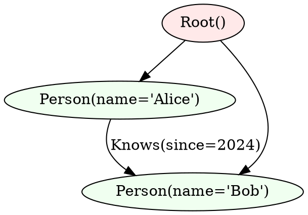

# Testing & Debugging

Comprehensive guide to testing and debugging your Jac applications.

## Testing Framework

### Writing Tests

Tests in Jac use the `test` keyword followed by an identifier name:

```jac
def add(a: int, b: int) -> int {
    return a + b;
}

obj Circle {
    has radius: float;

    def area() -> float {
        return 3.14159 * self.radius ** 2;
    }
}

# Test names are identifiers (not strings)
test test_add {
    assert add(2, 3) == 5;
}

test test_circle {
    c = Circle(radius=5.0);
    assert c.radius == 5.0;
    assert c.area() > 78;
}

test test_list {
    items: list[int] = [1, 2, 3];
    assert len(items) == 3;
    assert sum(items) == 6;
}
```

### Assertions

```jac
test test_assertions {
    # Basic equality
    assert 1 + 1 == 2;

    # With custom message
    assert 1 == 1, "Math should work";

    # Comparisons
    assert 5 > 3;
    assert 3 < 5;
    assert 5 >= 5;
    assert 5 <= 5;
    assert 5 != 3;

    # Boolean assertions
    assert True;
    assert not False;

    # Collection assertions
    assert 3 in [1, 2, 3];
    assert "key" in {"key": "value"};
}
```

### Testing Walkers and Graphs

```jac
node Counter {
    has count: int = 0;
}

walker Incrementer {
    can increment with Counter entry {
        here.count += 1;
    }
}

test test_walker {
    # Create graph
    counter = root ++> Counter();

    # Spawn walker
    Incrementer() spawn root;

    # Verify result
    assert counter[0].count == 1;
}
```

---

## Running Tests

### Command: `jac test`

```bash
jac test [filepath] [options]
```

### Options

| Option | Short | Default | Description |
|--------|-------|---------|-------------|
| `--test_name` | `-t` | "" | Run specific test by name |
| `--filter` | `-f` | "" | Filter tests by pattern |
| `--xit` | `-x` | false | Exit on first failure |
| `--maxfail` | `-m` | None | Stop after N failures |
| `--directory` | `-d` | "" | Test directory |
| `--verbose` | `-v` | false | Verbose output |

### Examples

```bash
# Run all tests in a file
jac test main.jac

# Run with verbose output
jac test main.jac -v

# Run specific test
jac test main.jac -t test_add

# Filter tests by pattern
jac test main.jac -f "test_circle"

# Stop on first failure
jac test main.jac -x

# Stop after 3 failures
jac test main.jac -m 3

# Run tests in a directory
jac test -d tests/

# Combine options
jac test -d tests/ -v -x
```

### Test Output

```
unittest.case.FunctionTestCase (test_add) ... ok
unittest.case.FunctionTestCase (test_circle) ... ok
unittest.case.FunctionTestCase (test_list) ... ok

----------------------------------------------------------------------
Ran 3 tests in 0.000s

OK
Passed successfully.
```

### Failed Test Output

```
unittest.case.FunctionTestCase (test_fail) ... FAIL

======================================================================
FAIL: unittest.case.FunctionTestCase (test_fail)
----------------------------------------------------------------------
Traceback (most recent call last):
  File "test.jac", line 8, in test_fail
    assert 1 == 2, "This will fail";
AssertionError: 1 != 2

----------------------------------------------------------------------
Ran 1 test in 0.001s

FAILED (failures=1)
```

---

## Interactive Debugger

### Command: `jac debug`

```bash
jac debug <filename> [options]
```

### Options

| Option | Short | Default | Description |
|--------|-------|---------|-------------|
| `--main` | `-m` | true | Run as main module |
| `--cache` | `-c` | false | Use bytecode cache |

### Starting the Debugger

```bash
jac debug main.jac
```

This launches an interactive debugger where you can:

- Set breakpoints
- Step through code
- Inspect variables
- Examine the call stack

---

## Graph Visualization

### Command: `jac dot`

Generate DOT format graph visualizations of your program's graph state.

```bash
jac dot <filename> [options]
```

### Options

| Option | Short | Default | Description |
|--------|-------|---------|-------------|
| `--session` | `-s` | "" | Session name for persistence |
| `--initial` | `-i` | "" | Initial node ID |
| `--depth` | `-d` | -1 | Traversal depth (-1 = unlimited) |
| `--traverse` | `-t` | false | Traverse connections |
| `--bfs` | `-b` | false | Use BFS (default: DFS) |
| `--edge_limit` | `-e` | 512 | Maximum edges |
| `--node_limit` | `-n` | 512 | Maximum nodes |
| `--saveto` | `-sa` | "" | Save to file |
| `--to_screen` | `-to` | false | Print to stdout |
| `--format` | `-f` | "dot" | Output format |

### Examples

```bash
# Print graph to screen
jac dot main.jac --to_screen

# Save to file
jac dot main.jac --saveto graph.dot

# Use existing session
jac dot main.jac -s my_session --to_screen

# Limit traversal depth
jac dot main.jac -d 3 --to_screen

# Use BFS instead of DFS
jac dot main.jac -b --to_screen

# Limit output size
jac dot main.jac -e 100 -n 100 --to_screen
```

### Sample Output



### Rendering the Graph

```bash
# Generate DOT and render with Graphviz
jac dot main.jac --saveto graph.dot
dot -Tpng graph.dot -o graph.png

# Or pipe directly
jac dot main.jac --to_screen | dot -Tpng -o graph.png
```

---

## IR Inspection Tools

### Command: `jac tool ir`

Inspect the internal representation of your Jac code.

```bash
jac tool ir <subcommand> <filename>
```

### Subcommands

| Subcommand | Description |
|------------|-------------|
| `py` | View generated Python code |
| `sym` | View symbol table (text) |
| `sym.` | View symbol table (DOT format) |
| `ast` | View abstract syntax tree (text) |
| `ast.` | View AST (DOT format) |
| `docir` | View document IR |
| `pyast` | View Python AST |
| `unparse` | View unparsed code |
| `esast` | View ES (JavaScript) AST |
| `es` | View generated JavaScript |

### View Generated Python

```bash
jac tool ir py main.jac
```

**Output:**

```python
"""Simple test examples for documentation."""
from __future__ import annotations
from jaclang.pycore.jaclib import Obj, jac_test

def add(a: int, b: int) -> int:
    return a + b

class Circle(Obj):
    radius: float

    def area(self) -> float:
        return 3.14159 * self.radius ** 2
```

### View Symbol Table

```bash
jac tool ir sym main.jac
```

**Output:**

```
###############
# main        #
###############
SymTable::Module(main)
+-- Symbols
|   +-- Circle
|   |   +-- public object
|   |   +-- decl: line 7, col 5
|   |   +-- defn
|   |   |   +-- line 7, col 5
|   |   +-- uses
|   +-- add
|       +-- public ability
|       +-- decl: line 3, col 5
+-- Sub Tables
    +-- SymTable::Ability(add)
    |   +-- Symbols
    |   |   +-- a
    |   |   |   +-- public variable
    |   |   |   +-- decl: line 3, col 9
```

### View AST

```bash
jac tool ir ast main.jac
```

### Generate DOT Graphs

```bash
# Symbol table as DOT
jac tool ir sym. main.jac > symbols.dot
dot -Tpng symbols.dot -o symbols.png

# AST as DOT
jac tool ir ast. main.jac > ast.dot
dot -Tpng ast.dot -o ast.png
```

---

## Troubleshooting Guide

### Common Errors

#### "MongoDB not available, using ShelfMemory"

**Cause:** MongoDB is not running or not configured.

**Solution:** This is informational. ShelfMemory (file-based) persistence will be used. To use MongoDB:

```bash
# Start MongoDB (local)
mongod

# Or configure in jac.toml
[plugins.scale.database]
mongodb_uri = "mongodb://localhost:27017"
```

#### Stale State Errors

**Cause:** ShelfMemory persistence (`anchor_store.db`) contains stale state from previous runs.

**Solution:** Delete the anchor store file:

```bash
rm .jac/data/anchor_store.db
# Or
rm -rf .jac/data/
```

#### "non-default argument follows default argument"

**Cause:** In inheritance, child class has required attributes after parent's optional attributes.

**Solution:** Give all child attributes defaults:

```jac
obj Parent {
    has name: str = "Parent";
}

obj Child(Parent) {
    has child_attr: str = "default";  # Must have default
}
```

#### Walker Not Executing

**Cause:** Walker doesn't have a root handler to start traversal.

**Solution:** Add `can start with \`root entry`:

```jac
walker MyWalker {
    can start with `root entry {
        visit [-->];  # Start traversal
    }

    can process with Person entry {
        print(here.name);
        visit [-->];
    }
}
```

#### Import Errors

**Cause:** Module not found or incorrect import syntax.

**Solution:** Check import syntax:

```jac
# Correct
import from byllm.lib { Model }
import os;

# Incorrect
from byllm.lib import Model  # Python syntax, won't work
```

### Debugging Tips

1. **Print Debugging**

   ```jac
   with entry {
       print(f"Debug: value = {my_var}");
   }
   ```

2. **Check Generated Python**

   ```bash
   jac tool ir py main.jac
   ```

3. **Inspect Symbol Table**

   ```bash
   jac tool ir sym main.jac
   ```

4. **Visualize Graph State**

   ```bash
   jac dot main.jac --to_screen
   ```

5. **Run Single Test**

   ```bash
   jac test main.jac -t test_specific -v
   ```

6. **Clear Cached State**

   ```bash
   rm -rf .jac/
   ```

---

## Best Practices

### Test Organization

```
myproject/
├── jac.toml
├── src/
│   └── main.jac
└── tests/
    ├── test_models.jac
    ├── test_walkers.jac
    └── test_integration.jac
```

### Test Naming

```jac
# Good: Descriptive names
test test_user_creation_with_valid_email { ... }
test test_walker_visits_all_nodes { ... }

# Avoid: Vague names
test test1 { ... }
test my_test { ... }
```

### Isolate Tests

```jac
test test_isolated {
    # Create fresh graph for this test
    node = root ++> TestNode();

    # Test operates on isolated state
    walker spawn root;

    # Assertions on isolated state
    assert node[0].value == expected;
}
```

### Test Configuration

```toml
# jac.toml
[test]
directory = "tests"
verbose = true
fail_fast = false
max_failures = 10
```

---

## See Also

| Topic | Resource |
|-------|----------|
| The Jac Book: Testing | [Chapter 17](../jac_book/chapter_17.md) |
| Debugger Guide | [Debugger](../learn/debugger.md) |
| CLI Reference | [All Commands](../cli/index.md) |
| Configuration | [jac.toml Reference](../configuration/index.md) |
