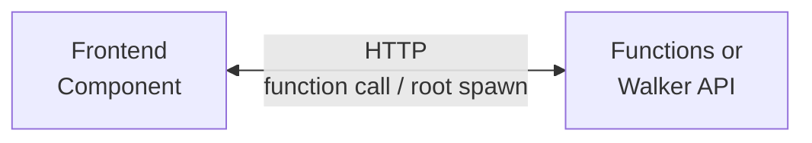

# Backend Integration

Connect your frontend components to Jac walkers for data fetching and mutations.

> **Prerequisites**
>
> - Completed: [State Management](state.md)
> - Familiar with: [What Makes Jac Different](../../quick-guide/what-makes-jac-different.md) (core concepts)
> - Time: ~30 minutes

---

## How It Works

In Jac full-stack apps:

1. **Backend** = Functions or walkers that process data and return results
2. **Frontend** = Components in `cl { }` blocks
3. **Connection** = Direct function calls (`await func()`) or walker spawning (`root spawn Walker()`)



### Two Backend Approaches

Jac offers two ways to create backend endpoints:

| Approach | Syntax | Best For |
|----------|--------|----------|
| **Functions** | `def:pub get_tasks -> list { ... }` | Simple CRUD, quick prototyping |
| **Walkers** | `walker:pub get_tasks { can fetch with Root entry { ... } }` | Graph traversal, multi-step operations |

Both become HTTP endpoints automatically. Functions are simpler -- the frontend calls them directly with `await func()`. Walkers are more powerful -- they traverse the graph and report results, called with `root spawn Walker()`.

Use `def:priv` / `walker:priv` for authenticated endpoints with per-user data isolation. See the [AI Day Planner tutorial](../first-app/build-ai-day-planner.md) for both approaches side by side.

---

## Setting Up the Backend

### Define Your Data Model

```jac
node Task {
    has id: str;
    has title: str;
    has created_at: str;
    has completed: bool = False;
}
```

### Create Walker Endpoints

```jac
import from datetime { datetime }
import uuid;

walker:pub get_tasks {
    can fetch with Root entry {
        tasks = [-->](?:Task);
        report [
            {
                "id": t.id,
                "title": t.title,
                "completed": t.completed,
                "created_at": t.created_at
            }
            for t in tasks
        ];
    }
}

walker:pub add_task {
    has title: str;

    can create with Root entry {
        new_task = Task(
            id=str(uuid.uuid4()),
            title=self.title,
            completed=False,
            created_at=datetime.now().isoformat()
        );
        root ++> new_task;
        report {
            "id": new_task.id,
            "title": new_task.title,
            "completed": new_task.completed
        };
    }
}

walker:pub toggle_task {
    has task_id: str;

    can toggle with Root entry {
        for task in [-->](?:Task) {
            if task.id == self.task_id {
                task.completed = not task.completed;
                report {"success": True, "completed": task.completed};
                return;
            }
        }
        report {"success": False, "error": "Task not found"};
    }
}

walker:pub delete_task {
    has task_id: str;

    can remove with Root entry {
        for task in [-->](?:Task) {
            if task.id == self.task_id {
                del task;
                report {"success": True};
                return;
            }
        }
        report {"success": False, "error": "Task not found"};
    }
}
```

---

## Calling Walkers from Frontend

### Basic Pattern with `root spawn`

Use `root spawn walker_name()` to call walkers from client code:

```jac
# Import walkers from your main module
sv import from ...main { get_tasks, add_task, toggle_task }

cl {
    def:pub TaskList() -> JsxElement {
        has tasks: list = [];
        has loading: bool = True;
        has error: str = "";

        # Fetch data on component mount
        async can with entry {
            await load_tasks();
        }

        async def load_tasks() -> None {
            loading = True;
            error = "";
            try {
                result = root spawn get_tasks();
                if result.reports and result.reports.length > 0 {
                    tasks = result.reports[0];
                }
            } except e {
                error = f"Failed to load: {e}";
            }
            loading = False;
        }

        if loading {
            return <p>Loading tasks...</p>;
        }

        if error {
            return <p className="error">Error: {error}</p>;
        }

        return <ul>
            {tasks.map(lambda task: any -> any {
                return <li key={task["id"]}>{task["title"]}</li>;
            })}
        </ul>;
    }
}
```

### Understanding `root spawn` Results

| Property | Type | Description |
|----------|------|-------------|
| `result.reports` | list | Array of reported values from walker |
| `result.reports[0]` | any | First reported value (most common) |

---

## Mutations (Create, Update, Delete)

```jac
sv import from ...main { get_tasks, add_task, toggle_task, delete_task }

cl {
    def:pub TaskManager() -> JsxElement {
        has tasks: list = [];
        has new_title: str = "";
        has loading: bool = True;

        # Load tasks on mount
        async can with entry {
            await load_tasks();
        }

        async def load_tasks() -> None {
            loading = True;
            result = root spawn get_tasks();
            if result.reports and result.reports.length > 0 {
                tasks = result.reports[0];
            }
            loading = False;
        }

        # Add new task
        async def handle_add() -> None {
            if new_title.trim() {
                result = root spawn add_task(title=new_title.trim());
                if result.reports and result.reports.length > 0 {
                    tasks = tasks.concat([result.reports[0]]);
                }
                new_title = "";
            }
        }

        # Toggle task completion
        async def handle_toggle(task_id: str) -> None {
            result = root spawn toggle_task(task_id=task_id);
            if result.reports and result.reports[0]["success"] {
                tasks = tasks.map(lambda t: any -> any {
                    if t["id"] == task_id {
                        return {**t, "completed": not t["completed"]};
                    }
                    return t;
                });
            }
        }

        # Delete task
        async def handle_delete(task_id: str) -> None {
            result = root spawn delete_task(task_id=task_id);
            if result.reports and result.reports[0]["success"] {
                tasks = tasks.filter(lambda t: any -> bool {
                    return t["id"] != task_id;
                });
            }
        }

        return <div>
            <div className="add-task">
                <input
                    value={new_title}
                    onChange={lambda e: any -> None { new_title = e.target.value; }}
                    onKeyPress={lambda e: any -> None {
                        if e.key == "Enter" { handle_add(); }
                    }}
                    placeholder="New task..."
                />
                <button onClick={lambda -> None { handle_add(); }}>
                    Add
                </button>
            </div>

            {loading and <p>Loading...</p>}

            <ul className="task-list">
                {tasks.map(lambda task: any -> any {
                    return <li key={task["id"]}>
                        <input
                            type="checkbox"
                            checked={task["completed"]}
                            onChange={lambda -> None { handle_toggle(task["id"]); }}
                        />
                        <span className={task["completed"] and "completed"}>
                            {task["title"]}
                        </span>
                        <button onClick={lambda -> None { handle_delete(task["id"]); }}>
                            Delete
                        </button>
                    </li>;
                })}
            </ul>
        </div>;
    }
}
```

---

## Error Handling

### Try-Catch Pattern

```jac
sv import from ...main { submit_data }

cl {
    def:pub SafeSubmit() -> JsxElement {
        has error_msg: str = "";
        has submitting: bool = False;

        async def handle_submit(data: dict) -> None {
            submitting = True;
            error_msg = "";

            try {
                result = root spawn submit_data(payload=data);
                if result.reports and result.reports.length > 0 {
                    response = result.reports[0];
                    if not response["success"] {
                        error_msg = response["error"];
                    }
                }
            } except e {
                error_msg = f"Network error: {e}";
            }

            submitting = False;
        }

        return <div>
            {error_msg and <div className="error">{error_msg}</div>}
            <button
                onClick={lambda -> None { handle_submit({"key": "value"}); }}
                disabled={submitting}
            >
                {("Submitting..." if submitting else "Submit")}
            </button>
        </div>;
    }
}
```

### Loading States Pattern

```jac
cl {
    def:pub DataView() -> JsxElement {
        has data: any = None;
        has loading: bool = True;
        has error: str = "";

        async can with entry {
            await fetch_data();
        }

        async def fetch_data() -> None {
            loading = True;
            try {
                result = root spawn get_data();
                if result.reports and result.reports.length > 0 {
                    data = result.reports[0];
                }
            } except e {
                error = f"Failed to load: {e}";
            }
            loading = False;
        }

        if loading {
            return <div className="skeleton">
                <div className="skeleton-line"></div>
                <div className="skeleton-line"></div>
            </div>;
        }

        if error {
            return <div className="error">
                <p>{error}</p>
                <button onClick={lambda -> None { fetch_data(); }}>
                    Retry
                </button>
            </div>;
        }

        return <div className="data">
            {JSON.stringify(data)}
        </div>;
    }
}
```

---

## Real-Time Updates

### Polling Pattern

```jac
cl {
    import from react { useEffect }

    def:pub LiveData() -> JsxElement {
        has data: any = None;
        has loading: bool = True;

        async def fetch_data() -> None {
            result = root spawn get_live_data();
            if result.reports and result.reports.length > 0 {
                data = result.reports[0];
            }
            loading = False;
        }

        # Initial fetch
        async can with entry {
            await fetch_data();
        }

        # Poll every 5 seconds
        useEffect(lambda -> None {
            interval = setInterval(lambda -> None { fetch_data(); }, 5000);
            return lambda -> None { clearInterval(interval); };
        }, []);

        return <div>
            {loading and <p>Loading...</p>}
            {data and <p>Last updated: {data["timestamp"]}</p>}
        </div>;
    }
}
```

---

## Complete Example: Task App

```jac
# main.jac - Combined backend and frontend

# === Backend: Data Model ===
node Task {
    has id: str;
    has title: str;
    has completed: bool = False;
}

# === Backend: Walkers ===
walker:pub get_tasks {
    can fetch with Root entry {
        report [-->](?:Task);
    }
}

walker:pub add_task {
    has title: str;

    can create with Root entry {
        import uuid;
        task = Task(id=str(uuid.uuid4()), title=self.title);
        root ++> task;
        report task;
    }
}

walker:pub toggle_task {
    has task_id: str;

    can toggle with Root entry {
        for t in [-->](?:Task) {
            if t.id == self.task_id {
                t.completed = not t.completed;
                report t;
                return;
            }
        }
    }
}

# === Frontend: UI ===
cl {
    def:pub app() -> JsxElement {
        has tasks: list = [];
        has input_text: str = "";
        has loading: bool = True;

        # Load tasks on mount
        async can with entry {
            result = root spawn get_tasks();
            if result.reports {
                tasks = result.reports;
            }
            loading = False;
        }

        async def add() -> None {
            if input_text.trim() {
                result = root spawn add_task(title=input_text.trim());
                if result.reports and result.reports.length > 0 {
                    tasks = tasks.concat([result.reports[0]]);
                }
                input_text = "";
            }
        }

        async def toggle(task_id: str) -> None {
            result = root spawn toggle_task(task_id=task_id);
            if result.reports and result.reports.length > 0 {
                updated = result.reports[0];
                tasks = tasks.map(lambda t: any -> any {
                    if t.id == task_id {
                        return updated;
                    }
                    return t;
                });
            }
        }

        return <div className="app">
            <h1>My Tasks</h1>

            <div className="input-row">
                <input
                    value={input_text}
                    onChange={lambda e: any -> None { input_text = e.target.value; }}
                    onKeyPress={lambda e: any -> None {
                        if e.key == "Enter" { add(); }
                    }}
                    placeholder="Add a task..."
                />
                <button onClick={lambda -> None { add(); }}>Add</button>
            </div>

            {loading and <p>Loading...</p>}

            {not loading and (
                <ul>
                    {tasks.map(lambda t: any -> any {
                        return <li
                            key={t.id}
                            style={{"textDecoration": t.completed and "line-through"}}
                            onClick={lambda -> None { toggle(t.id); }}
                        >
                            {t.title}
                        </li>;
                    })}
                </ul>
            )}
        </div>;
    }
}
```

---

## Key Takeaways

| Concept | Usage |
|---------|-------|
| Import walkers | `sv import from ...main { walker_name }` |
| Call walker | `result = root spawn walker_name(args)` |
| Get results | `result.reports[0]` |
| Node spawn | `node_id spawn walker_name(args)` |
| Error handling | `try { ... } except e { ... }` |

---

## Next Steps

- [Authentication](auth.md) - Add user login
- [Routing](routing.md) - Multi-page applications
- [Build an AI Day Planner](../first-app/build-ai-day-planner.md) - Complete full-stack example with AI integration

**Reference:**

- [Walker Responses](../../reference/language/walker-responses.md) - Understanding `.reports` patterns
- [Graph Operations](../../reference/language/graph-operations.md) - Node creation, traversal, deletion
- [Part III: OSP Reference](../../reference/language/osp.md) - Complete walker and node language reference
