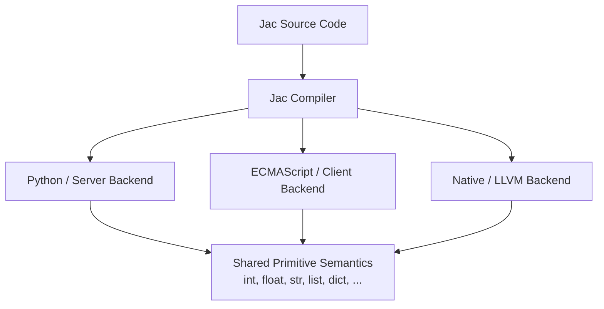

# Primitives and Codespace Semantics

**On this page:**

- [Overview](#overview) - What are primitives and why they matter across codespaces
- [Codespace Model](#codespace-model) - Server, Client, and Native compilation targets
- [Primitive Types](#primitive-types) - The fixed set of types shared across all codespaces
- [Operator Semantics](#operator-semantics) - Uniform operator behavior across backends
- [Builtin Functions](#builtin-functions) - Functions available in every codespace
- [Backend Contract](#backend-contract) - How each codespace implements the primitives

---

## Overview

Jac programs can target multiple execution environments -- a Python-based server, a JavaScript-based browser client, or a native LLVM-compiled binary -- yet all three share the **same source language** and the **same set of primitive types, operators, and builtin functions**. This page documents that fixed set of semantics: the contract that every Jac codespace must honor.

The key insight is that Jac's compiler does not simply transpile syntax; it implements a **primitive codegen interface** -- a collection of abstract emitter classes that each backend (Python/server, ECMAScript/client, Native/LLVM) must subclass. This ensures that an `int` behaves like an `int`, a `list` behaves like a `list`, and `print()` works -- regardless of where the code executes.



---

## Codespace Model

A **codespace** determines *where* your code runs. You do not say where: the compiler **infers** each declaration's codespace from the code itself. When a decision must be forced, the override is a `[placement.pins]` entry in `jac.toml` (see [Placement](../placement.md)), never syntax in the source.

The rules are:

- **Server is the default.** Python imports, graph archetypes, and similar constructs anchor a module server, and unreferenced pure code in such a module compiles to the Python backend, exactly as before.
- **Client is inferred.** Declarations whose syntax is structurally client-only -- JSX, or a string-path import from the npm ecosystem (`import from "react" { ... }`) -- are placed in the client codespace automatically. From those seeds, placement propagates through symbol references: a helper, `glob`, or import that client code uses joins the client bundle too. Propagation is scope-aware (a local variable that shadows a module-level name does not count) and never relocates things the compiler already bridges across the boundary -- `def:pub` endpoints and walkers stay on the server behind auto-generated RPC calls, and top-level objects referenced from both sides are shared into the bundle.
- **Native is inferred from FFI surfaces -- and at module granularity.** An import whose braces contain C-ABI function *declarations* (`import from raylib { def InitWindow(w: i32, h: i32, title: str) -> None; }`) declares an extern surface only the native backend can satisfy, so it seeds native placement, and code using those extern names follows. Consuming a native *module* (`import from mymod { fast_fn }` where `mymod` is native) is NOT a native signal -- that is the server-to-native interop crossing. Whole anchor-free modules are placed at module granularity: under `[build] default_codespace = "native"` (the default), the placement solver compiles a module native when its import closure can lower, and a module that prefers native but cannot lower demotes to the server codespace with a note. Inside a server-anchored module, native-*compatible* pure code stays server: there, compatibility is not intent, and the decision stays with `"native"` pins or the forced path (`jac nacompile` / `jac build --as native` / `CompileOptions(force_codespace='native')`).
- **Pins always win.** Inference never overrides a `[placement.pins]` entry.

### Inferred placement (the default)

A full-stack module carries no placement annotations at all:

```jac
import from "clsx" { clsx }             # npm import: seeds client

def:pub fetch_items() -> list[dict] {   # server endpoint (def:pub contract)
    return [{"id": 1, "name": "Item A"}];
}

def row_class(i: int) -> str {          # used by client code: pulled client
    return clsx(["row", "even" if i % 2 == 0 else "odd"]);
}

def:pub app() -> JsxElement {           # JSX: seeds client
    has items: list = [];
    async def load() -> None {
        items = await fetch_items();    # compiler generates the HTTP call
    }
    <ul>{[<li class={row_class(i)}>{it}</li> for (i, it) in enumerate(items)]}</ul>
}
```

Here `app` and the `clsx` import are client (JSX and npm are client-only syntax), `row_class` is pulled into the client bundle because client code calls it, and `fetch_items` remains a server endpoint -- the client call site compiles to an authenticated HTTP request, not a relocation.

### Codespaces at a glance

| Codespace | How code gets there | Compiles To | Ecosystem |
|-----------|--------------------|-------------|-----------|
| Server    | inferred (the default; python imports and graph archetypes anchor); `[placement.pins]` -> `"server"` | Python | PyPI |
| Client    | inferred (JSX, browser globals, npm imports); `[placement.pins]` -> `"client"` | JavaScript / TypeScript | npm |
| Native    | inferred (extern C declarations, whole-module verdict); `[placement.pins]` -> `"native"`; forced via `jac nacompile` / `jac build --as native` | LLVM IR → machine code | C ABI |

When inference would put a declaration somewhere it must not go -- most usefully, when something must stay on the server even though client code references it -- pin it in `jac.toml`:

```toml
[placement.pins]
"mymod.audit_log" = "server"
```

```jac
def add(a: int, b: int) -> int { return a + b; }   # server (default)

def audit_log(msg: str) -> None {   # pinned server via [placement.pins];
    print("audit:", msg);           # client callers bridge over RPC
}
```

A pin also serves when a file with no client-only syntax should still ship to the browser (a module-level `"client"` pin). Review the outcome with `jac check <entry> --placements`.

### Cross-Codespace Interop

When code in one codespace calls a function in another, the compiler generates the interop layer automatically -- HTTP calls between server and client, FFI bridges between Python and native, serialization and deserialization at boundaries. A server module's `def:pub` surface never relocates, so a client-side import of it is a boundary import, not a relocation:

```jac
import from .backend { fetch_items }      # target's endpoints stay server-side

def:pub app() -> JsxElement {
    has items: list = [];
    async def load() -> None {
        items = await fetch_items();      # compiler generates the HTTP call
    }
    <ul>{items}</ul>
}
```

The import itself lives wherever its consumers live (here, the client bundle, as an RPC stub), while its target remains on the server. Between two server modules, the same import becomes a server-to-server microservice boundary when the target is listed in `[scale.microservices.routes]` (or its module is pinned `"server"`).

### What Is Shared

Regardless of codespace, the following are identical:

- **Primitive types** -- `int`, `float`, `str`, `bool`, `bytes`, `list`, `dict`, `set`, `tuple`, `frozenset`, `range`, `complex`
- **Operator semantics** -- `+` on two ints always means addition; `+` on two strings always means concatenation
- **Builtin functions** -- `print()`, `len()`, `range()`, `sorted()`, etc.
- **Type conversion** -- `int()`, `str()`, `float()`, `bool()`, etc.
- **Control flow** -- `if`, `for`, `while`, `match`, comprehensions

What *differs* between codespaces is the **underlying implementation**: Python objects, JavaScript values, or LLVM IR instructions. The compiler guarantees behavioral equivalence through the primitive emitter contract described below.

---

## Primitive Types

Jac defines 12 primitive type families. Each type has a fixed set of named methods and operator behaviors that all backends must implement.

### Numeric Types

#### `int` -- Integer

Arbitrary-precision integer (server), 64-bit integer (native), `number` / `BigInt` (client).

**Named methods:**

| Method | Description |
|--------|-------------|
| `bit_length()` | Number of bits needed to represent the value |
| `bit_count()` | Number of set bits (popcount) |
| `to_bytes(length, byteorder)` | Convert to bytes representation |
| `as_integer_ratio()` | Return `(numerator, denominator)` pair |
| `conjugate()` | Returns the value itself (complex compatibility) |
| `from_bytes(bytes, byteorder)` | *Static* -- construct int from bytes |

**Operators:**

| Category | Operators |
|----------|-----------|
| Arithmetic | `+` `-` `*` `/` `//` `%` `**` |
| Bitwise | `&` `\|` `^` `<<` `>>` |
| Comparison | `==` `!=` `<` `>` `<=` `>=` |
| Unary | `-x` `+x` `~x` |

#### `float` -- Floating Point

IEEE 754 double-precision (64-bit) across all codespaces.

**Named methods:**

| Method | Description |
|--------|-------------|
| `is_integer()` | True if the float is an exact integer value |
| `as_integer_ratio()` | Exact `(numerator, denominator)` pair |
| `conjugate()` | Returns the value itself |
| `hex()` | Hexadecimal string representation |
| `fromhex(s)` | *Static* -- construct float from hex string |

**Operators:**

| Category | Operators |
|----------|-----------|
| Arithmetic | `+` `-` `*` `/` `//` `%` `**` |
| Comparison | `==` `!=` `<` `>` `<=` `>=` |
| Unary | `-x` `+x` |

#### `complex` -- Complex Number

Complex number with real and imaginary parts.

**Named methods:**

| Method | Description |
|--------|-------------|
| `conjugate()` | Returns the complex conjugate |

**Operators:**

| Category | Operators |
|----------|-----------|
| Arithmetic | `+` `-` `*` `/` `**` |
| Comparison | `==` `!=` |
| Unary | `-x` `+x` |

!!! note "No ordering on complex"
    Complex numbers support equality checks but not ordering (`<`, `>`, `<=`, `>=`) -- this is enforced across all codespaces.

---

### String and Byte Types

#### `str` -- String

Unicode text string. Immutable.

**Named methods:**

| Category | Methods |
|----------|---------|
| Case conversion | `capitalize()`, `casefold()`, `lower()`, `upper()`, `title()`, `swapcase()` |
| Searching | `count()`, `find()`, `rfind()`, `index()`, `rindex()`, `startswith()`, `endswith()` |
| Modification | `replace()`, `strip()`, `lstrip()`, `rstrip()`, `removeprefix()`, `removesuffix()` |
| Splitting | `split()`, `rsplit()`, `splitlines()`, `join()`, `partition()`, `rpartition()` |
| Formatting | `format()`, `format_map()`, `center()`, `ljust()`, `rjust()`, `zfill()`, `expandtabs()` |
| Character tests | `isalnum()`, `isalpha()`, `isascii()`, `isdecimal()`, `isdigit()`, `isidentifier()`, `islower()`, `isnumeric()`, `isprintable()`, `isspace()`, `istitle()`, `isupper()` |
| Encoding | `encode()` |
| Translation | `translate()`, `maketrans()` |

**Operators:**

| Operator | Meaning |
|----------|---------|
| `+` | Concatenation |
| `*` | Repetition |
| `%` | printf-style formatting |
| `==` `!=` | Equality |
| `<` `>` `<=` `>=` | Lexicographic comparison |
| `in` | Substring test |

#### `bytes` -- Byte Sequence

Immutable sequence of bytes (0-255). Mirrors most `str` methods but operates on byte values.

**Named methods:**

| Category | Methods |
|----------|---------|
| Encoding | `decode()`, `hex()`, `fromhex()` |
| Searching | `count()`, `find()`, `rfind()`, `index()`, `rindex()`, `startswith()`, `endswith()` |
| Modification | `replace()`, `strip()`, `lstrip()`, `rstrip()`, `removeprefix()`, `removesuffix()` |
| Splitting | `split()`, `rsplit()`, `splitlines()`, `join()`, `partition()`, `rpartition()` |
| Case (ASCII) | `capitalize()`, `lower()`, `upper()`, `title()`, `swapcase()` |
| Char tests (ASCII) | `isalnum()`, `isalpha()`, `isascii()`, `isdigit()`, `islower()`, `isspace()`, `istitle()`, `isupper()` |
| Alignment | `center()`, `ljust()`, `rjust()`, `zfill()`, `expandtabs()` |
| Translation | `translate()`, `maketrans()` |

**Operators:**

| Operator | Meaning |
|----------|---------|
| `+` | Concatenation |
| `*` | Repetition |
| `%` | printf-style formatting |
| `==` `!=` | Equality |
| `<` `>` `<=` `>=` | Lexicographic comparison |
| `in` | Byte membership |

---

### Collection Types

#### `list` -- Mutable Sequence

Ordered, mutable collection. Supports indexing, slicing, and iteration.

**Named methods:**

| Method | Description |
|--------|-------------|
| `append(x)` | Add item to end |
| `extend(iterable)` | Append all items from iterable |
| `insert(i, x)` | Insert item at position |
| `remove(x)` | Remove first occurrence |
| `pop([i])` | Remove and return item at index |
| `clear()` | Remove all items |
| `index(x)` | Index of first occurrence |
| `count(x)` | Count occurrences |
| `sort()` | Sort in-place |
| `reverse()` | Reverse in-place |
| `copy()` | Shallow copy |

**Operators:**

| Operator | Meaning |
|----------|---------|
| `+` | Concatenation |
| `*` | Repetition |
| `==` `!=` | Structural equality |
| `<` `>` `<=` `>=` | Lexicographic comparison |
| `in` | Membership test |
| `+=` | Extend in-place |
| `*=` | Repeat in-place |

#### `dict` -- Key-Value Mapping

Ordered mapping from keys to values (insertion order preserved).

**Named methods:**

| Method | Description |
|--------|-------------|
| `get(key[, default])` | Get value or default |
| `keys()` | View of keys |
| `values()` | View of values |
| `items()` | View of key-value pairs |
| `pop(key[, default])` | Remove and return value |
| `popitem()` | Remove and return last pair |
| `setdefault(key[, default])` | Get or set default |
| `update(mapping)` | Update from another mapping |
| `clear()` | Remove all items |
| `copy()` | Shallow copy |
| `fromkeys(iterable[, value])` | *Static* -- create dict from keys |

**Operators:**

| Operator | Meaning |
|----------|---------|
| `\|` | Merge (returns new dict) |
| `==` `!=` | Structural equality |
| `in` | Key membership |
| `\|=` | Update in-place |

#### `set` -- Mutable Unordered Collection

Unordered collection of unique hashable elements.

**Named methods:**

| Category | Methods |
|----------|---------|
| Mutation | `add()`, `remove()`, `discard()`, `pop()`, `clear()` |
| Set algebra | `union()`, `intersection()`, `difference()`, `symmetric_difference()` |
| In-place algebra | `update()`, `intersection_update()`, `difference_update()`, `symmetric_difference_update()` |
| Tests | `issubset()`, `issuperset()`, `isdisjoint()`, `copy()` |

**Operators:**

| Operator | Meaning |
|----------|---------|
| `\|` | Union |
| `&` | Intersection |
| `-` | Difference |
| `^` | Symmetric difference |
| `==` `!=` | Set equality |
| `<=` `<` | Subset / proper subset |
| `>=` `>` | Superset / proper superset |
| `in` | Membership |
| `\|=` `&=` `-=` `^=` | In-place variants |

#### `frozenset` -- Immutable Set

Same semantics as `set` but immutable -- no mutation methods and no in-place operators. Supports all the same algebra operators and comparison operators.

#### `tuple` -- Immutable Sequence

Ordered, immutable collection. Supports indexing and iteration.

**Named methods:**

| Method | Description |
|--------|-------------|
| `count(x)` | Count occurrences |
| `index(x)` | Index of first occurrence |

**Operators:**

| Operator | Meaning |
|----------|---------|
| `+` | Concatenation |
| `*` | Repetition |
| `==` `!=` | Structural equality |
| `<` `>` `<=` `>=` | Lexicographic comparison |
| `in` | Membership test |

#### `range` -- Immutable Integer Sequence

Lazy integer sequence, typically used in `for` loops.

**Named methods:**

| Method | Description |
|--------|-------------|
| `count(x)` | Count occurrences |
| `index(x)` | Index of value |

**Operators:**

| Operator | Meaning |
|----------|---------|
| `==` `!=` | Equality |
| `in` | Membership test |

---

### Fixed-Width Types (Native Codespace)

The native codespace adds fixed-width types for C interop. These types map directly to hardware registers and C ABI types:

| Jac Type | Width | Signed | C Equivalent |
|----------|-------|--------|--------------|
| `i8` | 8-bit | Yes | `int8_t` |
| `u8` | 8-bit | No | `uint8_t` |
| `i16` | 16-bit | Yes | `int16_t` |
| `u16` | 16-bit | No | `uint16_t` |
| `i32` | 32-bit | Yes | `int32_t` |
| `u32` | 32-bit | No | `uint32_t` |
| `i64` | 64-bit | Yes | `int64_t` |
| `u64` | 64-bit | No | `uint64_t` |
| `f32` | 32-bit | -- | `float` |
| `f64` | 64-bit | -- | `double` |
| `c_void` | -- | -- | `void*` |

The compiler automatically coerces between Jac's standard types (`int` = `i64`, `float` = `f64`) and fixed-width types at call boundaries.

---

## Operator Semantics

Operators in Jac have consistent meaning across codespaces. The following table summarizes which operators are defined for each primitive type family:

### Arithmetic Operators

| Operator | int | float | complex | str | bytes | list | tuple |
|----------|-----|-------|---------|-----|-------|------|-------|
| `+` | add | add | add | concat | concat | concat | concat |
| `-` | sub | sub | sub | -- | -- | -- | -- |
| `*` | mul | mul | mul | repeat | repeat | repeat | repeat |
| `/` | truediv | truediv | truediv | -- | -- | -- | -- |
| `//` | floordiv | floordiv | -- | -- | -- | -- | -- |
| `%` | mod | mod | -- | format | format | -- | -- |
| `**` | pow | pow | pow | -- | -- | -- | -- |

### Comparison Operators

| Operator | int | float | complex | str | bytes | list | tuple | dict | set |
|----------|-----|-------|---------|-----|-------|------|-------|------|-----|
| `==` `!=` | yes | yes | yes | yes | yes | yes | yes | yes | yes |
| `<` `>` `<=` `>=` | yes | yes | **no** | lexicographic | lexicographic | lexicographic | lexicographic | **no** | subset/superset |

### Bitwise Operators

| Operator | int | dict | set |
|----------|-----|------|-----|
| `&` | bitwise AND | -- | intersection |
| `\|` | bitwise OR | merge | union |
| `^` | bitwise XOR | -- | symmetric diff |
| `<<` `>>` | shift | -- | -- |
| `~` | invert | -- | -- |

### Membership Operator

The `in` operator is defined for all container types:

| Type | `x in container` tests |
|------|------------------------|
| `str` | Substring containment |
| `bytes` | Byte membership |
| `list` | Element membership |
| `tuple` | Element membership |
| `set` / `frozenset` | Element membership |
| `dict` | Key membership |
| `range` | Value membership |

---

## Builtin Functions

These functions are available in every codespace. Each backend provides its own implementation, but the behavior is the same:

!!! note "Backtick Escaping for `any`"
    The `any` builtin function must be escaped as `` `any `` to distinguish it from the `any` built-in type. This convention ensures that the type checker and compiler can correctly resolve whether you are referring to the gradual type or the boolean aggregation function.

### I/O

| Function | Description |
|----------|-------------|
| `print(...)` | Output text to the console / debug log |
| `input([prompt])` | Read a line of text from stdin |

### Aggregation and Ordering

| Function | Description |
|----------|-------------|
| `len(x)` | Length of a collection or string |
| `abs(x)` | Absolute value |
| `round(x[, n])` | Round to *n* decimal places |
| `min(...)` | Minimum value |
| `max(...)` | Maximum value |
| `sum(iterable)` | Sum of elements |
| `sorted(iterable)` | Return a new sorted list |
| `reversed(seq)` | Reverse iterator |

### Iteration

| Function | Description |
|----------|-------------|
| `enumerate(iterable)` | Pairs of `(index, value)` |
| `zip(...)` | Parallel iteration over multiple iterables |
| `map(fn, iterable)` | Apply function to each element |
| `filter(fn, iterable)` | Keep elements where function returns true |
| `range([start,] stop[, step])` | Integer sequence |
| `iter(x)` | Get an iterator |
| `next(iterator)` | Get next value from iterator |

### Type Checking

| Function | Description |
|----------|-------------|
| `isinstance(obj, type)` | Check if object is instance of type |
| `issubclass(cls, type)` | Check if class is subclass |
| `type(obj)` | Get the type of an object |
| `callable(obj)` | Check if object is callable |

### Introspection

| Function | Description |
|----------|-------------|
| `id(obj)` | Unique identity of an object |
| `hash(obj)` | Hash value |
| `repr(obj)` | String representation |
| `getattr(obj, name)` | Get attribute by name |
| `setattr(obj, name, val)` | Set attribute by name |
| `hasattr(obj, name)` | Check attribute existence |
| `delattr(obj, name)` | Delete attribute |
| `vars(obj)` | Dictionary of attributes |
| `dir(obj)` | List of names in scope |

### Numeric Conversions

| Function | Description |
|----------|-------------|
| `chr(i)` | Integer to Unicode character |
| `ord(c)` | Character to integer |
| `hex(i)` | Integer to hex string |
| `oct(i)` | Integer to octal string |
| `bin(i)` | Integer to binary string |
| `pow(x, y[, z])` | Power with optional modulus |
| `divmod(a, b)` | `(quotient, remainder)` pair |
| `any(iterable)` | True if any element is truthy |
| `all(iterable)` | True if all elements are truthy |

### Type Constructors

Every primitive type can be constructed explicitly:

| Function | Description |
|----------|-------------|
| `int(x)` | Convert to integer |
| `float(x)` | Convert to float |
| `str(x)` | Convert to string |
| `bool(x)` | Convert to boolean |
| `list(x)` | Convert to list |
| `dict(x)` | Convert to dict |
| `set(x)` | Convert to set |
| `tuple(x)` | Convert to tuple |
| `frozenset(x)` | Convert to frozenset |
| `bytes(x)` | Convert to bytes |
| `complex(re, im)` | Construct complex number |
| `range(...)` | Construct range |
| `slice(...)` | Construct slice |
| `bytearray(x)` | Construct mutable byte array |

### Other

| Function | Description |
|----------|-------------|
| `open(file, mode)` | Open a file |
| `format(value, spec)` | Format a value |
| `ascii(obj)` | ASCII representation |
| `new(cls, ...args)` | Portable constructor: `cls(*args)` on the server; `Reflect.construct(cls, [args])` in `cl` blocks |

---

## Backend Contract

The primitive semantics are enforced through a system of **abstract emitter classes** defined in the compiler. Each class is parameterized on two types:

- **`V`** -- the value representation (e.g., `str` for ECMAScript code generation, `ir.Value` for LLVM)
- **`C`** -- the context type (e.g., `ESEmitCtx`, `NativeEmitCtx`)

Each backend must subclass and implement every emitter:

```mermaid
graph TD
    subgraph "Primitive Emitter Interface"
        INT["IntEmitter[V, C]"]
        FLOAT["FloatEmitter[V, C]"]
        STR["StrEmitter[V, C]"]
        BYTES["BytesEmitter[V, C]"]
        LIST["ListEmitter[V, C]"]
        DICT["DictEmitter[V, C]"]
        SET["SetEmitter[V, C]"]
        FROZEN["FrozensetEmitter[V, C]"]
        TUPLE["TupleEmitter[V, C]"]
        RANGE["RangeEmitter[V, C]"]
        COMPLEX["ComplexEmitter[V, C]"]
        BUILTIN["BuiltinEmitter[V, C]"]
    end

    subgraph "Server Backend"
        PY_INT["PyIntEmitter"]
        PY_STR["PyStrEmitter"]
        PY_ETC["..."]
    end

    subgraph "Client Backend"
        ES_INT["ESIntEmitter"]
        ES_STR["ESStrEmitter"]
        ES_ETC["..."]
    end

    subgraph "Native Backend"
        NA_INT["NativeIntEmitter"]
        NA_STR["NativeStrEmitter"]
        NA_ETC["..."]
    end

    INT --> PY_INT
    INT --> ES_INT
    INT --> NA_INT
    STR --> PY_STR
    STR --> ES_STR
    STR --> NA_STR
```



### How It Works

1. **The compiler parses** your Jac source and builds a unified AST
2. **Type resolution** determines the type of every expression
3. **Codespace routing** assigns each block of code to its target backend
4. **Code generation** calls the appropriate emitter method -- for example, `"hello" + " world"` calls `StrEmitter.emit_op_add()`
5. **Each backend's emitter** produces the correct output for its target: Python string concatenation, JavaScript `+`, or LLVM `@str_concat`

If a backend has not yet implemented an operation, the emitter returns `None`, allowing the dispatch layer to fall back or raise an error at compile time.

### What This Means for You

As a Jac developer, you do **not** need to think about emitters. The important takeaway is:

- The set of primitive types and their operations is **fixed and uniform** across all codespaces
- You can write `"hello".upper()` in server, client, or native code and get the same result
- Operators like `+`, `in`, `==` behave consistently regardless of compilation target
- If a type or operation is available in one codespace, it is available (or will be) in all of them

This is what makes Jac's multi-target compilation practical: you learn one set of types and operations, and they work everywhere.

---

## Learn More

**Related Reference:**

- [Types and Values](types-and-values.md) and [Operators](operators.md) - Type system and operator reference
- [Core Concepts](../../quick-guide/what-makes-jac-different.md) - Conceptual overview of codespaces
- [jac-client Reference](../plugins/jac-client.md) - Client codespace plugin details
